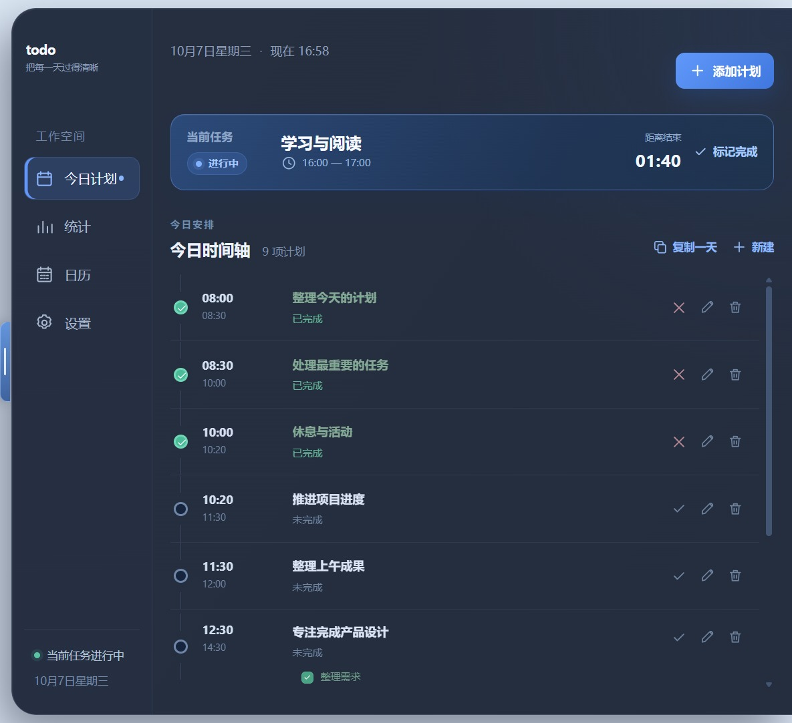

# todo

一款简洁的 Windows 桌面每日计划应用。计划数据仅保存在本机，应用支持贴靠屏幕右侧并自动收起。

<p align="center">
  
  
</p>

## 功能

- 按时间轴管理每天的计划，并自动识别当前任务
- 支持单日、日期范围及“每天 / 隔 6 休 1 / 隔 5 休 2”重复计划
- 检测时间冲突，并在复制或批量创建时提供处理选择
- 支持一级任务和子任务，完成状态自动同步
- 将某一天的完整计划复制到多个日期
- 通过月历查看每天的计划数量、名称和详细时间表
- 统计总计划、已完成和待完成任务
- 支持浅色、深色、跟随系统及背景透明度设置
- 任务结束时显示与主题一致的桌面提醒
- 窗口贴靠屏幕右侧，鼠标靠近时展开、离开后收起

## 开发运行

需要 Windows 和 Node.js 20.19 或更高版本。

```powershell
npm install
npm run dev
```

开发模式会同时启动页面开发服务器和 Electron 桌面窗口。

## 检查与本地运行

```powershell
npm run typecheck
npm test
npm run build
npm start
```

`npm start` 会打开已经构建完成的桌面应用。

## 构建 Windows 应用

```powershell
npm install
npm run dist:win
```

打包完成后，`release` 目录中会生成安装版 `todo-Setup-版本号-x64.exe` 和免安装版 `todo-Portable-版本号-x64.exe`。该目录属于构建产物，不提交到源码仓库；正式版本可以通过 GitHub Releases 发布。

安装版可在 Windows“设置 → 应用”中卸载；免安装版直接删除程序文件即可。当前发布包未购买代码签名证书，Windows 首次运行时可能显示“未知发布者”，可通过发布页提供的 SHA-256 校验值核对文件。

## 本地数据

任务和显示设置保存在当前 Windows 用户的 `%APPDATA%\daily-plan` 目录中，不会上传到服务器，也不会写入源码仓库。该目录沿用旧版名称以保留已有任务。卸载应用后如需彻底清除数据，可以手动删除此目录。

## 参与开发

欢迎提交 Issue 和 Pull Request。提交前请运行：

```powershell
npm run typecheck
npm test
npm run build
```

## 开源许可

本项目采用 [MIT License](LICENSE)。
